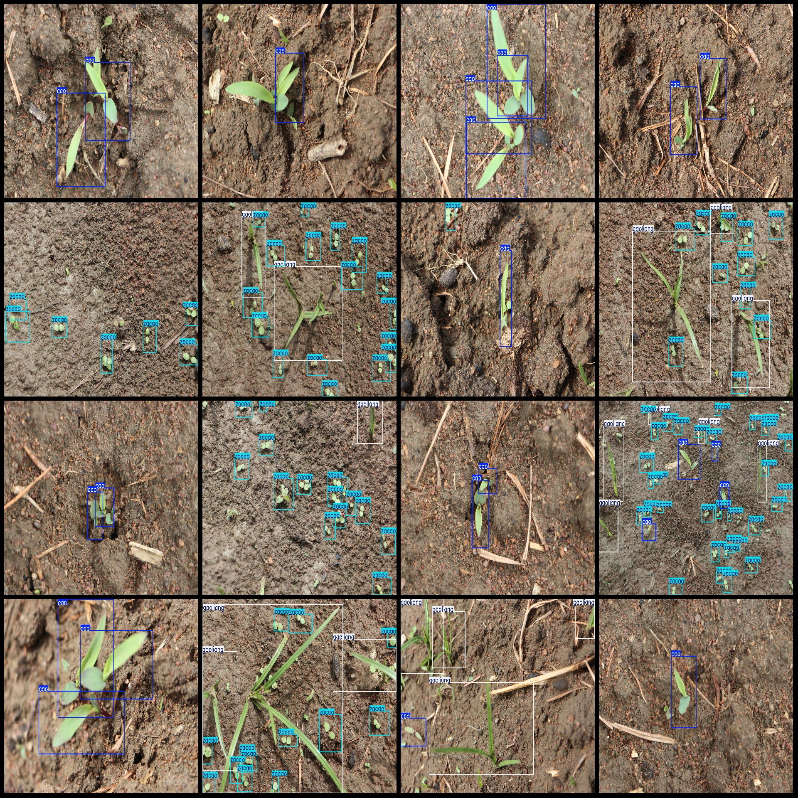
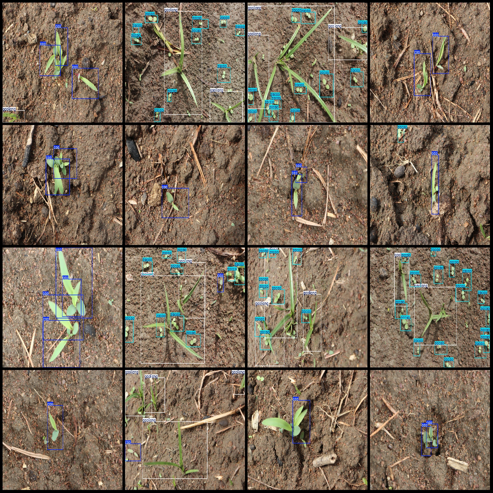

# Intelligent Agriculture Maize Seedling and Weed Detection Dataset: VOC+YOLO Format with 25 Images in 3 Categories

Dataset Format: Pascal VOC format plus YOLO format (txt file without split path, only containing jpg images along with corresponding VOC format xml files and YOLO format txt files)
Number of Images (jpg File Count): 25
Number of Annotations (XML File Count): 25
Number of Annotations (Txt File Count): 25
Number of Annotation Categories: 3
Annotation Categories Names (Note that the order of categories in the YOLO format does not match this, but is based on the "labels" folder's "classes.txt" file): ["cao", "gaoliang", "zacao"]
Number of Boxes per Category:
cao (Weed) Boxes = 37
gaoliang (Maize Seedling) Boxes = 31
zacao (Weed Seedling) Boxes = 140
Total Boxes: 208
Number of Images per Category:
cao (Weed) Images = 17
gaoliang (Maize Seedling) Images = 11
zacao (Weed Seedling) Images = 11
Image Resolution: 6000x4000
Annotation Tool Used: labelImg
Annotation Rules: Draw a box around the category
Important Notice: The dataset does not have a separate training validation test split; it needs to be divided by oneself.
Special Statement: This dataset does not guarantee any accuracy for models trained or weights saved.
Image Preview:
Annotation Example:

## Images

Here is a pay link on Stripe ( https://buy.stripe.com/3cs8yP7sY87d0vu9AB ). Please contact me lonlonago@foxmail.com after funding $89, and I will send you a complete data files , thank you!

